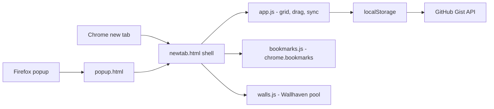

# Glisters

Keyboard-first new tab extension — shortcut grid, live Chrome bookmarks, Wallhaven wallpapers, single-user GitHub Gist sync. No backend, no sign-in.


## Install

```bash
git clone https://github.com/FirozChauhan/Glisters && cd Glisters
npm install
npm run build
```

Then load unpacked:
- **Chrome** → `chrome://extensions` → Developer mode → select this folder
- **Firefox** → `about:debugging#/runtime/this-firefox` → select `dist/firefox/manifest.json`

## Usage

```bash
# vim-style keys on the new tab
h j k l   # move      a  # add shortcut
enter     # open      e  # edit
d         # delete    w  # next wallpaper
```

## Features

- Shortcut grid with vim keys + mouse drag-reorder
- Live Chrome bookmarks sidebar (shared across devices)
- Daily Wallhaven wallpaper pool (optional API key for NSFW)
- One secret GitHub Gist as your entire sync backend

## Environment Variables

Copy `.env.example` to `.env`, then `npm run build` to regenerate `js/config.js` (gitignored):

```bash
GIST_ID=              # required for sync — id from your secret gist URL
GITHUB_TOKEN=         # required for sync — classic PAT, `gist` scope only
WALLHAVEN_API_KEY=    # optional — unlocks NSFW purity
```

## Architecture



Last-write-wins by `updatedAt`; the gist is always authoritative on boot, so a wiped local store can never clobber real data.

## Development

```bash
npm run build          # config + icons + ts → js/
npm run build:all      # + firefox zip (AMO-ready)
npm run build:test     # test build → dist/firefox-test/ (Gist sync stripped)
npm run typecheck
```

### Testing safety — read before automating the extension

**Never point an automated browser (Puppeteer/Selenium/Playwright) at the repo
root or `dist/firefox/` — those carry the real Gist credentials.** A headless
test instance once pushed its seed links over the user's curated cloud list.
Always `npm run build:test` and load `dist/firefox-test/`: its `js/config.js`
has blank credentials, so sync is physically disabled. As a runtime backstop,
`src/sync.ts` refuses all pushes when `navigator.webdriver === true` (every
automation stack sets it; a real browser never does). Reads/pulls stay allowed.
The sync layer additionally refuses to push an empty favourites or links list
over a non-empty cloud one, and a profile seeded from `links.txt` always
adopts the cloud list instead of pushing the seed.

## License

[MIT](LICENSE)
