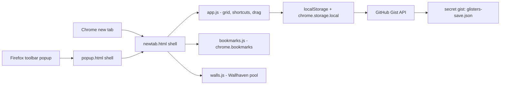

# GlistersV2 — New Tab

> Minimal new tab — shortcut grid, live Chrome bookmarks, Wallhaven wallpapers, GitHub Gist sync.


---

## Features

- **Shortcut grid** — vim-style keys (`h j k l`, `enter`, `a`, `e`, `d`) plus mouse drag-reorder with live flip animations and edge auto-flip across pages.
- **Live bookmarks sidebar** — a direct editor for Chrome's real bookmarks; changes from any device appear instantly.
- **Daily wallpaper pool** — 10 wide Wallhaven toplist shots cycled with `w`, favourites, a safe default, and optional NSFW (bring your own Wallhaven API key).
- **Single-user Gist sync** — your save (shortcuts + settings + wallpapers) lives in one secret GitHub Gist. No sign-in, no server, no database. Free, forever, with GitHub's built-in revision history as your backup.
- **One-line clone → build** — copy `.env.example` to `.env`, add your gist id + token, `npm run build`. `js/config.js` is generated and **gitignored** (it holds your real token, which must never be committed).
- **No bundler, no framework, no runtime deps, no backend** — plain ES5 script tags.

## Architecture



**Chrome** uses `chrome_url_overrides.newtab`; **Firefox** has no newtab override, so the Firefox build mounts the same `newtab.html` inside a toolbar popup (`popup.html`, an extension-page iframe) with an "open in tab" affordance. All runtime code is shared — the only Firefox-specific files are the manifest, the popup shell, and `scripts/build-firefox.mjs`.

Sync safety rails: every save is last-write-wins by `updatedAt`; on boot the gist is pulled first and is **always** authoritative over a fresh-install seed, so a wiped local store can never clobber real data.

## Setup (one time)

1. **Create a secret gist** at https://gist.github.com (one file, any content — the extension manages a `glisters-save.json` file inside it).
2. **Create a personal access token** at https://github.com/settings/tokens — classic token with **`gist` scope only** (fine-grained tokens also work; allow read/write on just that gist).
3. Fill in `.env` (copy from `.env.example`) and regenerate the committed config:

```bash
cp .env.example .env   # GIST_ID=<the long id from the gist url>
                       # GITHUB_TOKEN=<your token>
npm run build          # regenerates js/config.js + icons
```

That's it. The extension reads/writes the gist directly — no Cloudflare, no Clerk, no database.

## Run Locally

Node ≥18 for the scripts; the extension itself is zero npm dependencies.

```bash
# chrome — load unpacked from chrome://extensions
chrome://extensions → Developer mode → Load unpacked → this folder

# firefox — temporary add-on from about:debugging
about:debugging#/runtime/this-firefox → Load Temporary Add-on → dist/firefox/manifest.json
```

## Build Firefox zip

```bash
npm run build:firefox      # → dist/glisters-firefox-<version>.zip (AMO-ready)
npm run lint:firefox       # web-ext lint
```

## Configuration

| Env var | Required | Effect |
|---|---|---|
| `GIST_ID` | ✅ | Enables sync (the secret gist that holds your save) |
| `GITHUB_TOKEN` | — | Enables sync (token scoped to `gist` only) |
| `WALLHAVEN_API_KEY` | — | Unlocks NSFW (never shipped — you add your own) |

## Project Structure

```
js/app.js                 Grid, shortcuts, drag-reorder, sync orchestration
js/bookmarks.js           Bookmarks sidebar — direct chrome.bookmarks editor
js/walls.js               Wallhaven pool, favourites, safe wallpaper, blob cache
js/sync.js                Thin GitHub Gist client (GET/PATCH the gist file)
js/config.example.js      Reference config (no secrets) — js/config.js is gitignored
scripts/                  Build helpers (gen-config, gen-icons, build-firefox)
manifest.firefox.json     Firefox manifest (toolbar popup entry, gecko id)
popup.html / popup.js     Firefox popup shell — iframes newtab.html
css/popup.css             Popup shell sizing/styling
links.txt                 Optional first-run seed, one URL per line
```

---

Never lose a save, never lose a favourite.

---

<div align="left">
  <font face="Aref Ruqaa" size="5">فیروز خان چوہان</font>
</div>
